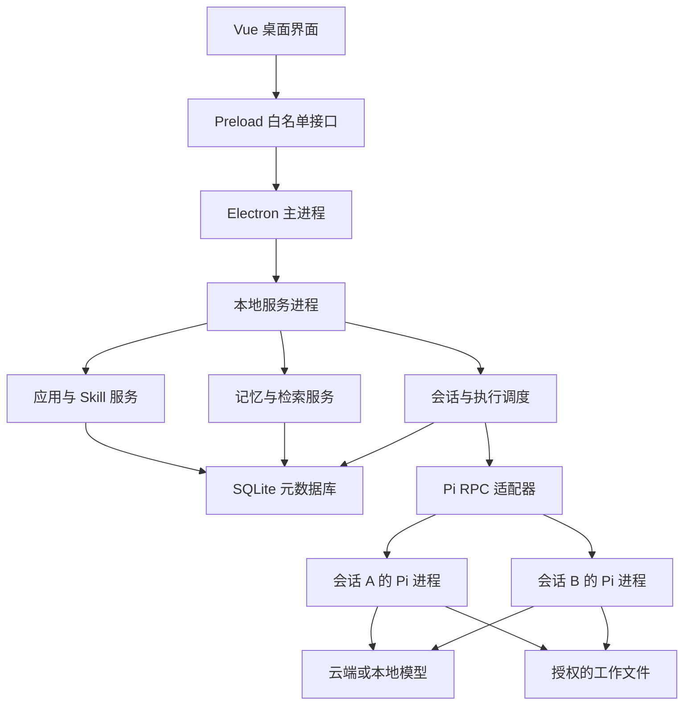
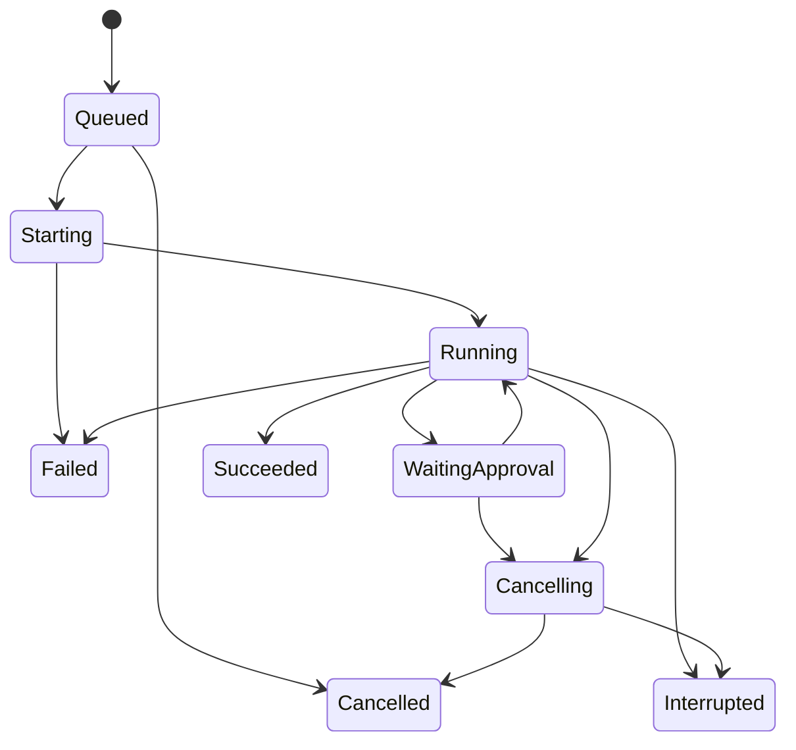

# Windows 本地 AI 应用管理平台：产品与技术架构设计

版本：v1.0（设计提案）  
日期：2026-09-27  
范围：Windows 本地单用户桌面平台，以 Pi 为 Agent 执行引擎  
状态：用于需求评审、开发拆解和技术验证；不是已实现功能或性能承诺。

## 1. 设计结论

采用 **Electron + Vue 3 + TypeScript + 本地 Node.js 服务 + SQLite + Pi RPC 子进程**。

平台只部署一份受管理的 Pi 运行时。用户创建的每个 AI 应用拥有独立的角色配置、Skill 清单、对话空间、应用记忆和文件空间；用户先浏览应用列表，再进入一个应用发起或继续对话。

一个应用可以有多个会话；每个正在执行的会话绑定一个 Pi 子进程；一个进程在同一时刻只服务一个会话。应用存在不代表其进程必须常驻。

Pi 负责模型推理与工具执行循环。平台负责应用目录、会话路由、长期记忆、进程管理、权限策略、文件产物和备份。长期记忆是平台建设的能力，不能把 Pi 聊天记录或上下文压缩直接当作完整的长期记忆系统。

本文以下标记区分能力来源：**原生**表示官方已公开的 Pi / Electron 能力；**平台实现**表示需要自行开发；**待验证**表示必须针对锁定版本进行技术验证。

## 2. 目标与边界

### 2.1 用户目标

- 在应用首页看到已有应用，例如需求分析、代码助手、公众号写作、资料整理。
- 无需手工编辑配置文件，即可创建应用、指定模型、编写角色说明并绑定 Skill。
- 进入应用后拥有专属聊天列表，可新建、继续、重命名、搜索和删除对话。
- 每个应用能记住用户在该应用内确认的偏好、术语、项目事实和工作约定。
- 看见任务正在做什么，能够停止执行、查看产物并恢复中断前的对话。
- 数据默认保存在本机，支持备份、迁移和删除。

### 2.2 第一版假设

- Windows 11 x64、单 Windows 用户、单桌面平台实例；其他版本另行验证。
- 本地存储、桌面执行；模型可以接云端 API 或兼容的本地推理服务。
- 使用云端模型时，选入上下文的消息、文件和记忆会发送给模型服务商。“本地平台”不等于“全部计算离线”。
- 首版只支持经过用户信任或平台审核的 Skill；不承诺隔离任意恶意插件。
- 平台有应用创建能力；首版不引入云端账号、付费市场、团队协作和多 Agent 自动协作编排。
- 用户可以同时打开多个应用；默认执行并发为 2，可配置，需通过实测调整。

### 2.3 最小闭环

创建应用 → 配置模型与 Skill → 测试连接 → 进入应用 → 新建会话 → 执行任务 → 查看结果 → 保存一条记忆 → 新会话使用该记忆。

## 3. 领域模型

| 概念 | 定义 | 生命周期与关系 |
|---|---|---|
| AI 应用 App | 用户可选择的一套能力与规则 | 有稳定 appId；包含多个配置版本和会话 |
| 应用版本 AppRevision | 模型、角色、Skill 及权限配置的快照 | 发布后不可变；新会话默认使用最新版本 |
| Skill | 指令及可选脚本、参考资料的能力包 | 可复用源包；每个应用绑定确定版本 |
| 会话 Conversation | 一个独立的连续对话上下文 | 只能属于一个应用；绑定配置版本 |
| 执行 Run | 用户一次提交触发的执行 | 属于一个会话；有状态、事件、用量和产物 |
| 工作区 Workspace | 应用可以处理的文件范围 | 默认会话独立目录；外部目录需显式授权 |
| 记忆 Memory | 可跨会话检索的持久事实或偏好 | 默认 appId 隔离；支持来源、版本与删除 |
| 知识文档 Knowledge | 用户导入的参考资料 | 不自动当作个人偏好或行为规则 |
| 产物 Artifact | 执行生成的文件 | 记录所属应用、会话、执行和路径 |
| 引擎进程 Worker | 正在运行的 Pi 实例 | 按需启动、空闲回收；不是应用本体 |

重要约束：appId、conversationId、runId 分别承担归属、上下文和执行关联，不能仅用一个“Agent ID”替代。

## 4. 产品功能与页面

### 4.1 应用首页

应用卡片展示名称、图标、简介、最近使用时间以及“可使用 / 配置未完成 / 缺少依赖”等状态。支持搜索、收藏、创建、编辑、复制、归档和删除。

“打开应用”进入应用空间，不立即启动模型任务。复制应用默认只复制配置和 Skill 绑定，不复制凭据、历史、记忆和产物。

### 4.2 创建应用向导

1. 基本资料：名称、简介、图标、分类。
2. 工作方式：角色说明、主要任务、输出要求、示例开场白。
3. 模型：选择提供商、模型及凭据引用，执行连接测试。
4. Skill：从平台技能库选择，或导入本地 Skill 文件夹。
5. 文件与工具：选择“仅对话”“受控文件处理”“可信自动化”模式及工作目录。
6. 记忆：默认仅手动保存；可开启自动提取候选、到期时间和注入预算。
7. 试运行：在临时测试会话执行一条任务，展示依赖问题；通过后发布首个版本。

角色说明与 Skill 可以协作：角色说明定义长期职责；Skill 描述某类任务的具体做法。不要把所有 Skill 全文直接拼进角色说明。

### 4.3 应用工作空间

- 左侧：该应用内的历史会话、新建会话、搜索。
- 中间：聊天消息、流式回复、工具执行卡片、任务状态、输入区、附件和停止按钮。
- 右侧可折叠：当前任务产物、被使用的记忆、应用能力说明。
- 顶部：应用名称、当前模型、设置入口及返回应用首页。

用户界面使用“正在读取文件”“正在生成文档”等可理解状态，不展示 RPC、PID 或 JSON 等实现术语；技术详情放入诊断页。

### 4.4 记忆管理页

列出记忆内容、类型、来源会话、更新时间、有效期、状态。支持新增、修改、停用、删除和冲突处理。“记住这条”只作用于当前应用；跨应用共享需用户单独指定，后续版本再开放。

### 4.5 执行与文件

支持新建执行、停止、手动重试、查看错误、打开产物所在目录。附件导入应用管理目录后再使用，不把前端提交的任意绝对路径直接传给 Agent。

删除会话时明确区分：删除聊天与附件、是否连同来源记忆和产物一并删除。应用删除先归档/移入回收区，彻底删除时包含索引与原始会话文件。

## 5. 技术选型与取舍

| 层 | 建议 | 选择原因与限制 |
|---|---|---|
| 桌面外壳 | Electron | Node.js 与子进程集成直接；可统一 TypeScript；安装包和内存较大 |
| 前端 | Vue 3 + Vite + TypeScript | 适合组件化聊天和管理界面 |
| UI 与状态 | Element Plus、Pinia、Vue Router | 管理表单、应用卡片和会话状态；具体版本开发时锁定 |
| 本地业务服务 | 独立 Node.js Service Host 进程 | 与 UI 生命周期和崩溃隔离，集中管理数据库和 Worker |
| 桌面通信 | preload 白名单 API + Electron IPC | 首版不用开放 localhost HTTP 端口 |
| Agent 引擎 | 受管理的 Pi CLI，RPC 模式 | 独立进程，便于停止、升级和故障隔离 [1] |
| 持久化 | SQLite + 文件系统 | 元数据与记忆放数据库，大文件与 Pi 会话文件单独保存 |
| 搜索 | SQLite FTS5 + 中文检索补充策略 | 初版不依赖向量数据库；中文需分词或 n-gram 派生索引 |
| 凭据 | Windows 凭据服务或 DPAPI 封装 | 数据库仅保存 secretRef；封装与打包兼容性需验证 |
| 打包 | Windows 安装包 + 固定 Node/Pi 版本 | 用户无需预先装 Node/npm；原生依赖与签名进入发布流程 |

Tauri 也是可选方案，但仍需管理 Node/Pi sidecar，并引入 Rust 与 WebView2 集成工作。当前目标优先降低集成复杂度，选择 Electron。以后若体积成为明确瓶颈再评估迁移。

首版不同时维护 FastAPI 和 Node.js 两套后端。若以后提供浏览器入口，在相同 Service 层上增加 HTTP/WebSocket 适配器即可，不重写核心服务。

## 6. 总体架构



### 6.1 模块职责

| 模块 | 核心职责 |
|---|---|
| AppService | 应用 CRUD、配置校验、版本发布、归档 |
| SkillRegistry | 导入校验、哈希、版本、依赖检测、应用绑定 |
| ConversationService | 会话归属、历史索引、Pi 会话路径映射 |
| RunScheduler | 排队、并发额度、单会话串行、停止与运行锁 |
| PiAdapter | 启动参数、协议转换、版本兼容、输出流与错误处理 |
| MemoryService | 保存、候选审核、去重、检索、注入快照 |
| FileService | 附件导入、产物登记、路径校验、配额 |
| CredentialService | 密钥加解密及进程级凭据注入 |
| PolicyService | 工具许可、路径许可、确认请求、审计 |
| BackupService | 一致性备份、恢复、数据库迁移 |

边界原则：Vue 不直接读磁盘、不启动 Pi、不持有 API Key；Pi 子进程不直接写平台元数据库；所有归属判定都在服务层完成。

## 7. Pi 集成设计

### 7.1 原生能力与平台责任

| 能力 | 实现归属 |
|---|---|
| 模型会话、工具循环、Skill 加载 | Pi 原生 |
| RPC 指令和流式事件 | Pi 原生 [1][2] |
| 指定 Agent 配置目录 | Pi 原生，PI_CODING_AGENT_DIR [3] |
| 应用列表、图标、创建向导 | 平台实现 |
| 应用级长期记忆与候选审核 | 平台实现 |
| 权限拦截、应用隔离、进程配额 | 平台实现，不能依赖提示词保障 |
| 聊天 UI、消息索引、产物管理 | 平台实现 |

### 7.2 配置与版本

平台数据库中的 AppRevision 是应用配置的权威来源。运行前由配置编译器生成只读快照目录，里面包含该版本的角色说明、模型配置和 Skill 文件。

PI_CODING_AGENT_DIR 指向会话私有的运行配置目录，该目录从应用版本生成，避免多个并行会话写同一份 settings/auth 文件。对用户而言仍是一套应用配置，不要求重复配置。

工作区中的 `.pi`、AGENTS 文件和通用 Skill 搜索路径可能改变行为；托管模式要使用锁定版本支持的禁用自动发现参数，只加载应用白名单 Skill 和平台扩展。项目指令导入作为显式功能，而不是无提示继承。

启动契约（概念示例，具体参数由适配器按锁定版本验证）：

```text
node.exe <bundled-pi-cli-entry> --mode rpc
  --session-dir <conversation-session-directory>
  --no-skills --skill <resolved-app-skill-directory>
  --no-context-files --no-extensions
  --extension <platform-policy-extension>
  --append-system-prompt <compiled-role-file>
```

附加约束：关闭不需要的自动提示模板/主题和项目配置加载；以受控 cwd 启动。需要恢复时追加平台记录的精确 `--session` 路径。不得用 `--continue` 推测应该恢复哪一个用户会话。

Windows 使用受管理 Node 可执行文件和 Pi CLI 的真实 JavaScript 入口，spawn 采用参数数组与 shell:false，避免 pi.cmd、空格路径和命令拼接问题。每个子进程单独构造 env，不修改服务进程的全局 process.env 来切换应用。

### 7.3 运行生命周期

1. 校验 conversationId 属于 appId，取得固定 AppRevision。
2. 创建 runId 和执行记录，获取会话锁及全局并发额度。
3. 解析 Skill 版本、凭据引用和文件权限，形成运行快照。
4. 检索应用记忆，生成此次执行的 memorySnapshot。
5. 按需启动 Worker，读取状态确认就绪，取得并保存真实 Pi sessionFile。
6. 安装事件监听后发送 prompt。新会话创建成功才写入会话映射；映射失败需回收 Worker。
7. 把事件规范化、持久化并发送 UI；UI 断开不阻塞 stdout 消费。
8. 等待引擎稳定空闲，再结合错误和取消信息确定执行结果。
9. 保存产物、使用量、记忆候选；释放执行锁。
10. 空闲 Worker 在约定 TTL 后关闭，下一次按精确 sessionFile 恢复。

RPC 的成功响应表示命令被接受，不等于任务完成。当前官方文档以 agent_settled 表达自动后续工作结束；handled 等不启动运行的响应需要单独处理。适配器必须覆盖这些分支，不能只看到 agent_end 就宣告成功。[1]

### 7.4 RPC 与事件

官方 prompt/abort 等指令示例：[2]

```json
{"id":"cmd-001","type":"prompt","message":"请整理附件内容"}
```

平台统一事件（以下为平台自定义，不是 Pi 原生结构）：

```json
{
  "eventId": "evt_123",
  "seq": 42,
  "appId": "app_writer",
  "conversationId": "conv_001",
  "runId": "run_009",
  "type": "assistant.delta",
  "payload": { "text": "正在整理" },
  "timestamp": "2026-09-27T02:00:00Z"
}
```

PiAdapter 按 LF 分隔解析 JSONL，持续读取 stdout，stderr 单独记录。为同一 run 分配单调递增 seq；不假设所有 Pi 事件都携带请求 ID。每个 Worker 同时只允许一个运行，由映射关系补充归属。[1]

UI 的停止操作先取消平台队列，再清理引擎待执行消息并发送 abort；超时后终止所属进程树。取消成功不意味着已执行的文件写入或外部操作自动回滚。[2]

### 7.5 兼容性

平台发布固定 Pi 版本、Node 版本、协议适配器版本和已验证扩展组合。禁止后台任意执行“升级到最新版”。升级在测试工作区验证 prompt、流式回复、停止、恢复、Skill 选择及权限拒绝后再启用，并保留回滚运行时。

## 8. Skill 管理

Skill 导入时识别 SKILL.md 元信息，检查引用文件、脚本依赖与名称冲突。原生 Skill 可包含指令及辅助脚本；描述决定自动匹配，明确任务可显式选择。[4]

平台采用“全局不可变源包 + 每应用版本绑定 + 运行时快照”。用户可将同一 Skill 绑定多个应用，但升级源包不会自动改变已发布应用。

| 字段 | 含义 |
|---|---|
| skillId / version / sha256 | 稳定标识、版本及内容完整性 |
| source / importedAt | 导入来源、导入时间 |
| entryFile | SKILL.md 入口 |
| declaredDependencies | Python、Node、命令行工具等声明 |
| capabilityProfile | 文件、网络、命令执行等需求 |
| enabled / invocationMode | 启用状态、自动匹配或显式调用 |

安装依赖属于独立安装流程，不在每次对话时自动执行未知安装脚本。Windows 不具备通用 Bash 环境，要求 Bash 的 Skill 应展示依赖，或提供经验证的 PowerShell/Python 版本。Python 环境按依赖组管理，不能假设内置 Node 就能运行所有 Skill。

导入压缩包防止路径穿越；可执行扩展与普通 Skill 分开管理。Skill 说明中的 allowed-tools 或自然语言约束不视为强制权限边界。

## 9. 会话、历史与长期记忆

### 9.1 三类状态分别保存

| 类型 | 保存位置 | 使用方式 |
|---|---|---|
| 当前会话上下文 | Pi session JSONL | 精确恢复引擎对话状态 |
| 聊天展示索引 | SQLite messages/events | UI 查询、搜索、重连与审计 |
| 长期记忆 | SQLite memories | 当前应用跨会话检索 |

Pi sessionFile 是恢复引擎上下文的权威记录。SQLite 消息是展示投影，可通过引擎消息接口或版本适配的会话读取器修复。平台不能直接修改 Pi JSONL 来“修复”逻辑。

新建会话不复制旧会话全文。长期记忆由平台检索后按预算注入。会话压缩摘要只服务该会话，不自动升级为跨会话事实。

### 9.2 记忆对象

建议字段：id、appId、type、content、sourceConversationId、sourceRunId、sourceMessageId、status、confidence、createdAt、updatedAt、expiresAt、version、supersedesId。

类型：偏好、事实、项目约定、术语。状态：候选、有效、冲突待处理、停用、删除。

默认保存规则：用户点击“记住这条”后直接有效；模型自动提取只生成候选；API Key、密码、临时日志和完整敏感文件不进入记忆。

用户修改记忆创建新版本。两条事实冲突时，显式用户确认优先于自动提取，未解决冲突不作为确定事实注入。

### 9.3 检索与注入

1. 根据可信会话归属取得 appId，先限定应用与有效状态。
2. 中文分词或 n-gram 索引检索；小数据可增加规范化关键词匹配。不能假设默认英文分词对中文足够。
3. 按相关性、用户固定优先级、更新时间与有效期排序。
4. 首版默认最多 8 条、约 1,500 token，结合模型上下文大小调整。
5. 构造带来源 ID 和版本的“参考记忆”区块，标记其为可更正的数据。
6. 保存 run_memory_links，便于界面展示本次使用了哪些记忆。

注入接口优先使用受控 Pi 扩展在模型调用前装配上下文；具体扩展事件接口需针对锁定版本验证。MVP 可在适配器发送 prompt 前包装“用户原文 + 参考记忆”，平台消息库仍保留用户原文并记录完整请求摘要。不要为每轮更新记忆重建系统提示词，也不要将检索到的文本解释为工具权限。

### 9.4 删除与遗忘语义

删除记忆后立即停止未来检索并清除其索引。但旧会话可能已含有该内容；继续旧会话不能承诺彻底忘记。提供“从新会话开始”和“清理关联历史”的选择。备份中的旧数据遵循备份保留期限，不假称删除数据库一条记录即从所有介质抹除。

### 9.5 后续扩展

知识文档切片、语义向量检索、用户级共享记忆作为下一阶段。向量索引必须继承 appId 过滤，不能先全库召回再只在 UI 隐藏其他应用结果。

## 10. 本地存储设计

建议数据根目录：`%LOCALAPPDATA%/LocalAIHub/`。应用本体装入程序目录，用户数据不随程序覆盖升级。

| 路径 | 内容 |
|---|---|
| data/platform.db | 应用、会话、运行、记忆、事件元数据 |
| apps/<appId>/revisions/<revisionId>/ | 已发布配置与角色快照 |
| apps/<appId>/conversations/<conversationId>/agent/ | 会话运行配置 |
| apps/<appId>/conversations/<conversationId>/sessions/ | Pi 会话文件 |
| apps/<appId>/conversations/<conversationId>/workspace/ | 会话默认工作文件 |
| apps/<appId>/conversations/<conversationId>/artifacts/ | 登记的输出文件 |
| apps/<appId>/shared/ | 显式跨会话共享资料 |
| skills/<skillId>/<version>/ | 不可变 Skill 源包 |
| cache/、logs/、backups/ | 缓存、脱敏日志与备份 |

文件命名使用 ID，不使用用户输入的应用名称作为路径。用户改名不移动内部数据。

### 10.1 主要数据表

| 表 | 关键字段 |
|---|---|
| apps | id, name, description, icon, status, currentRevisionId |
| app_revisions | id, appId, configJson, roleText, runtimeVersion, createdAt |
| skills | id, version, hash, sourcePath, metadataJson |
| app_skills | revisionId, skillId, skillVersion, enabled |
| conversations | id, appId, revisionId, title, piSessionFile, status |
| messages | id, conversationId, runId, role, contentJson, status, createdAt |
| runs | id, conversationId, requestId, state, startedAt, endedAt, error, usageJson |
| run_events | runId, seq, type, payloadJson, createdAt |
| memories | id, appId, type, content, status, version, sourceMessageId, expiresAt |
| run_memory_links | runId, memoryId, memoryVersion, injectedTextHash |
| artifacts | id, appId, conversationId, runId, relativePath, mimeType, size, hash |
| provider_profiles | id, provider, endpoint, secretRef, settingsJson |
| grants | id, appId, capability, resource, mode |
| schema_migrations | version, appliedAt |

外键、唯一键和事务必须启用；(conversationId, requestId) 用于重复提交去重；(runId, seq) 唯一。数据库由服务进程统一写入，采用 WAL，并设置 busy timeout。模型文本不作为 SQL 或路径执行。

### 10.2 数据一致性

不尝试让 SQLite 与 Pi JSONL 跨文件原子提交。平台维护 started/accepted/completed 阶段与事件序号；恢复时对照会话状态修复投影。完成消息在事务中写入，流式片段适度批量持久化；崩溃后允许丢失少量未落盘显示片段，但应通过引擎记录重建，且不能误显示为成功。

## 11. 平台接口契约

以下是自定义 IPC 业务接口，后续可映射为 HTTP；不是 Pi 原生命令。

| 接口 | 输入重点 | 输出/效果 |
|---|---|---|
| apps.list / create / update / archive | 配置与期望版本 | 应用摘要、配置版本 |
| skills.import / list / validate | 文件选择令牌、来源 | Skill 清单与依赖报告 |
| conversations.create / list / get | appId / conversationId | 会话及分页消息 |
| runs.submit | conversationId, requestId, text, attachmentIds | runId、队列状态 |
| runs.cancel | runId | 取消请求被接受 |
| runs.subscribe | runId, afterSeq | 从序号恢复事件流 |
| memories.list / save / update / delete | appId、记忆对象与版本 | 记忆更新结果 |
| artifacts.list / open | artifactId | 受验证的文件打开操作 |
| providers.test / save | providerProfile、凭据输入 | 连通性结果、secretRef |
| backups.create / restore | 用户选择的路径令牌 | 备份任务状态 |

每次请求在后端重新验证归属和数据类型。不得提供 renderer 可调用的任意 exec、任意 readFile 或任意 RPC 转发接口。

提交幂等：重复 requestId 返回原 runId；网络/IPC 超时不自动创建第二个执行。该机制只保证平台去重，不能保证外部工具副作用“恰好一次”。

## 12. 并发、状态和恢复

### 12.1 执行状态



只有确实配置了需要确认的工具能力时才出现 WaitingApproval。引擎空闲表示执行结束的条件之一，业务成功仍需结合模型/工具错误、退出状态和取消标记。

### 12.2 调度规则

- 同一会话一次仅有一个运行，后续提交在平台排队；首版不开放执行中插话以降低复杂度。
- 不同会话受全局并发额度限制。固定本地模型可另设每模型并发为 1。
- 空闲回收初始值 5 分钟；队列长度、空闲回收和执行超时均为可调整策略。
- 同一外部工作目录的写任务应串行，或使用 Git worktree；配置隔离无法解决文件写冲突。
- 大输出采用批量事件、截断显示与完整日志文件，避免 UI 渲染和数据库被输出淹没。

### 12.3 故障处理

| 情况 | 平台行为 |
|---|---|
| 模型限流或断网 | 显示可理解错误；由适配器协调重试，避免平台与引擎双重无限重试 |
| Pi 进程退出 | 标记 interrupted/failed，保留历史；用户确认后继续或重试 |
| 界面刷新/窗口重开 | 从服务状态及 afterSeq 恢复，不重新发送 prompt |
| 平台崩溃 | 启动时将旧 running 状态标为待核对；检查所属进程和会话记录 |
| 工具无响应 | 超时、请求取消、必要时终止所属进程树 |
| 磁盘满 | 暂停新执行，保留错误；不得继续显示已保存 |
| 记忆提取失败 | 原任务结果仍可用，候选提取单独重试 |

使用 Windows Job Object 管理 Worker 及其子进程，或验证过的等价进程树管理方案；这是需要实现/引入的系统能力，不是 Node spawn 自动提供。平台退出时提供停止任务或继续后台的明确选项；首版默认停止并完成状态落盘。

不可盲目重放崩溃前的工具调用，尤其涉及外部系统写入时。平台记录调用 ID、结果和审计信息，但不宣称能自动回滚所有操作。

## 13. 权限与隔离

### 13.1 隔离层级

1. 逻辑隔离：appId、独立配置、独立会话与记忆过滤。解决正常使用下的数据归属。
2. 工具隔离：平台注册受控文件工具和操作接口，在执行入口检查权限。
3. OS 隔离：对不可信脚本需要受限账户、沙箱或虚拟化环境。首版不提供完整的任意代码沙箱。

独立目录、cwd、单独 Pi 进程、系统提示词都不是 Windows 文件权限沙箱。拥有通用 shell 工具的进程仍可访问当前账户有权访问的其他路径。

### 13.2 首版模式

| 模式 | 工具范围 | 适用对象 |
|---|---|---|
| 仅对话 | 不开放文件与 shell | 写作、访谈、讨论 |
| 受控文件处理 | 平台封装的目录受限读写及已审核操作 | 文档整理、固定转换流程 |
| 可信自动化 | 明确开启通用 shell 和所需工具 | 用户信任的代码或脚本任务 |

受控模式必须关闭通用内置文件/shell 工具旁路，只暴露真正受控的替代工具。路径检查包含规范化、realpath、Windows junction/symlink、UNC 路径和读写模式；仅字符串前缀比较不足。即使如此，对任意恶意本地代码仍需 OS 隔离。

### 13.3 桌面与密钥

Renderer 开启 contextIsolation、禁用 nodeIntegration 并使用 sandbox；通过 preload 仅暴露白名单方法。Electron 官方说明 contextIsolation 用于隔开网页和 preload 的高权限上下文。[5]

Markdown/HTML 输出应净化；文件预览不执行产物中的脚本；外链打开校验协议。用户导入 Skill 时展示其脚本与权限需求。

API Key 不进入 renderer、日志、记忆或导出包。凭据服务在执行时注入所需密钥，环境变量继承采用白名单。要注明：可信自动化模式下，Agent 所运行代码可能读取进程凭据；如需更强隔离，应增加模型请求代理，避免将上游密钥直接交给 Worker。

## 14. 应用配置示例

以下 JSON 是平台清单示例，不是直接交给 Pi 的 settings.json。配置编译器负责转换。

```json
{
  "schemaVersion": 1,
  "appId": "app_requirements",
  "name": "需求分析助手",
  "description": "从一句话需求开始访谈，整理出可开发的需求文档",
  "revision": 1,
  "runtime": { "engine": "pi", "versionPolicy": "platform-pinned" },
  "model": { "providerProfileId": "provider_default", "modelId": "<已验证模型ID>" },
  "role": "你是一名软件产品分析师。逐步澄清目标、流程和验收条件，并标注未决问题。",
  "skills": [
    { "skillId": "requirements-interview", "version": "1.0.0", "enabled": true }
  ],
  "memory": { "enabled": true, "writeMode": "manual-or-review", "scope": "app", "maxItems": 8, "tokenBudget": 1500 },
  "permissions": { "mode": "controlled-files", "shell": false, "workspacePolicy": "per-conversation" },
  "execution": { "maxConcurrentRunsPerConversation": 1, "idleTtlSeconds": 300 }
}
```

修改角色、Skill 或权限生成新版本；正在运行的会话固定原版本，避免执行中途变化。旧会话升级配置必须显式创建迁移记录，或从当前内容新建分支会话；首版优先新建会话。

## 15. 工程目录与交付

建议采用 TypeScript monorepo：

| 目录 | 用途 |
|---|---|
| apps/desktop | Electron 主进程、preload、Vue 界面 |
| apps/service-host | 本地服务启动和进程通信 |
| packages/domain | 类型、状态机、业务规则 |
| packages/pi-adapter | Pi 启动、协议、版本适配 |
| packages/storage | SQLite 表结构、迁移、仓储 |
| packages/memory | 提取、检索、注入 |
| packages/policy | 工具授权、路径检查与审计 |
| packages/contracts | IPC schema、事件和错误类型 |
| resources/runtime | 固定版本 Node/Pi 及平台扩展 |
| tests/integration | Windows、RPC、隔离与恢复验证 |

打包时解析确定的 Pi 包/入口和许可证，不能硬编码未经验证的最新包名。涉及原生 SQLite 绑定时，按执行它的 Node ABI 构建。资源放在适合子进程访问的位置，避免将需要直接执行的文件只放在不可直接运行的归档内部。

Windows 发布验收覆盖中文路径、带空格用户名、长路径、非管理员安装和卸载保留用户数据。开发首阶段可要求开发机安装 Node/Pi，面向用户的发行版必须把依赖交付方式固定下来。

## 16. 备份、可观测性与性能

备份包含平台数据库、应用快照、Skill、会话文件、附件和产物清单。采用 SQLite 一致性备份及短暂停写/快照协调；不能在运行中简单复制 db 文件并忽略 WAL。默认不包含解密后的密钥。恢复到新 Windows 账户时重新绑定凭据。

日志记录 runId、阶段耗时、错误类别、进程退出码、模型用量和权限结果；默认不记录完整 prompt 或密钥。费用只在模型返回可靠用量且价格配置明确时估算，否则显示“未知”。

性能指标是开发目标，需在确定的测试机器上实测：

| 指标 | 初始目标 |
|---|---|
| 热启动打开首页 | 约 2 秒内 |
| 100 个应用的列表查询 | 本地查询 P95 小于 200ms |
| 提交后出现排队/执行反馈 | 200ms 内，不含模型首字时间 |
| 流式 UI 刷新 | 30–100ms 合并一次 |
| 记忆检索 | 1 万条单应用记忆下 P95 小于 300ms |
| 停止后 UI 确认已接收 | 200ms 内，实际终止另行展示 |

模型首字时间、生成速度和整体任务时长由模型及工具决定，不作为平台自身固定承诺。第一阶段不要为所有应用预启动 Worker。

## 17. 开发阶段与验收

### 阶段 0：技术验证

验证受管理 Node/Pi 在 Windows 下启动、JSONL 流式输出、取消、会话保存恢复、指定 Skill、平台扩展权限拒绝及凭据注入。锁定支持的 Pi 版本和事件映射，完成后再推进产品功能。

验收：两个不同应用分别执行任务且会话不混淆；含中文与空格的工作路径正常；停止后不残留所属工具子进程；恢复时不会重复执行上轮任务。

### 阶段 1：应用与对话 MVP

交付应用首页、创建向导、模型配置、Skill 导入、独立会话、流式回复、停止、产物、基本手动记忆和 SQLite 持久化。

验收：用户不编辑 JSON 即可创建应用并完成最小闭环；重启后历史可继续；两应用同名 Skill 不发生错误绑定；不同会话上下文不串用。

### 阶段 2：可靠性与记忆增强

增加记忆候选审核、中文搜索、事件重连、并发队列、备份恢复、配置版本和回收站。

验收：应用 A 的标记记忆不会被应用 B 检索；删除后未来检索不返回；崩溃后状态可解释；重复 requestId 不重复执行；备份在新数据目录恢复成功。

### 阶段 3：扩展能力

按需求增加知识库、向量检索、浏览器入口、定时任务、应用模板导出、模型代理和更强 OS 隔离。多 Agent 协作属于调度层新能力，独立规划，不混入第一版。

### 必须覆盖的关键测试

- Pi 适配器：响应乱序、分块 JSON、Unicode、错误、handled、完成、取消。
- 归属：伪造 appId/conversationId/artifactId 均被拒绝。
- 权限：路径穿越、junction、非授权目录访问、工具旁路。
- 生命周期：关窗口、睡眠唤醒、服务崩溃、Worker 崩溃、磁盘满。
- 记忆：冲突、过期、版本、中文召回、跨应用过滤、历史遗忘提示。
- 升级：数据库迁移失败可回退；Pi 版本不兼容不直接替换生产运行时。

## 18. 尚需产品确认的选择

本提案已给出默认值，以下事项可在开发前确认，不阻碍阶段 0 技术验证：

1. 首发是自用工具还是面向普通用户安装分发？默认按可分发桌面产品设计。
2. 首批模板有哪些？建议需求分析、写作、资料整理，代码自动化作为可信模式模板。
3. 首版优先哪些模型服务？默认提供通用提供商配置，由连接测试验证实际模型能力。
4. 是否需要处理不可信第三方 Skill？若是，OS 隔离应提前，而非只增加警告文案。
5. 是否必须支持外部浏览器访问？默认首版仅桌面界面，复用 Web 技术但不开放本地端口。
6. 自动记忆是否默认启用？本提案默认手动保存，自动提取需开启且先审核。

## 19. 官方依据与设计边界

以下资料于 2026-09-27 核对。Pi 文档属于持续更新内容，开发与发布必须以锁定版本的文档、类型和实际 `--help` 为准。

[1] Pi RPC：独立子进程、JSONL、响应与运行生命周期。  
https://pi.dev/docs/latest/rpc

[2] Pi RPC Commands：prompt、状态查询、消息查询、取消等协议。  
https://pi.dev/docs/latest/rpc-commands

[3] Pi Configuration：配置目录、角色文件和资源位置。  
https://pi.dev/docs/latest/configuration

[4] Pi Skills：技能结构、发现和调用原则。  
https://pi.dev/docs/latest/skills

[5] Electron Context Isolation：高权限 preload 与页面上下文隔离。  
https://electronjs.org/docs/latest/tutorial/context-isolation

[6] Pi CLI：参数及版本差异核对入口。  
https://pi.dev/docs/latest/cli

除上述原生机制外，本文应用结构、数据库、记忆策略、UI、调度、权限封装和验收指标均为本平台的设计建议，需要工程实现与验证。
