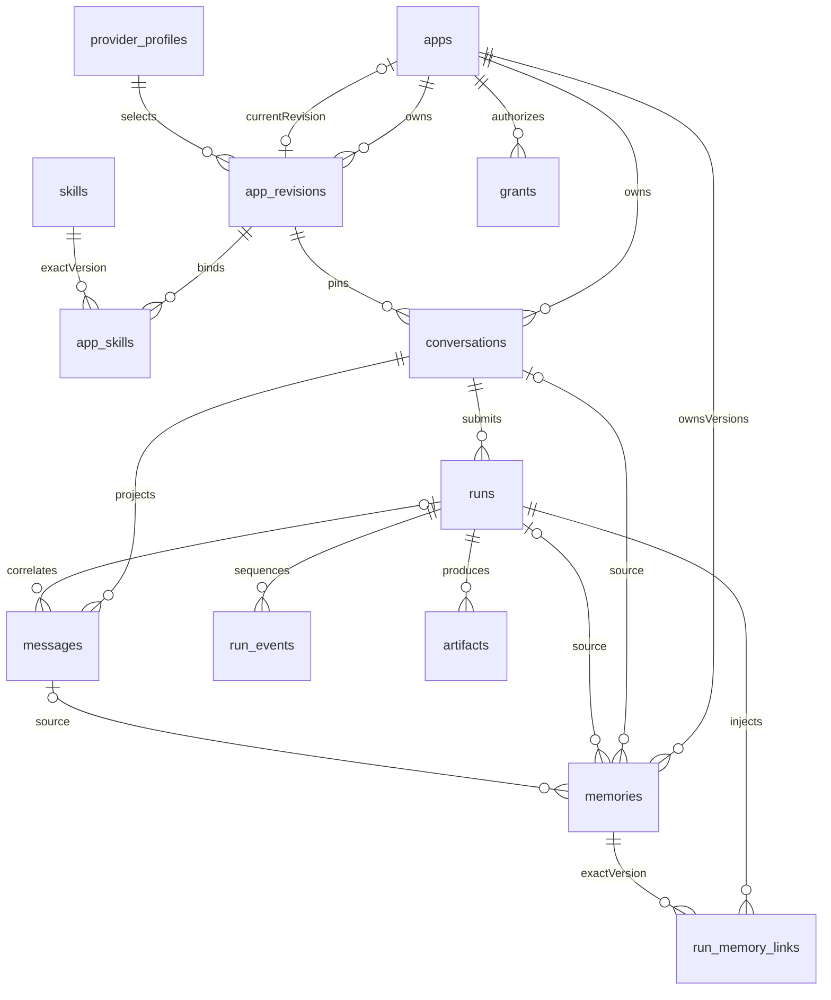

# 领域模型、SQLite 与数据目录

需求基线：[设计 v1 固定 commit](https://github.com/walkskysu/AIAppNest/blob/c6bdd1a6fdbb5b56486678d7169da8eb9b6f4dd7/docs/requirements/Windows_AI_App_Platform_Design_v1.md)，§3、§6.1、§9–12、§14–15。沿用技术验证 [Issue 01 / #1](https://github.com/walkskysu/AIAppNest/issues/1) 的 [Node/SQLite 运行时结论](pi-runtime-compatibility.md)：固定 Node 24.19.0、自带 `node:sqlite`，无需 Electron ABI 原生插件。工程 [Issue 02 / #3](https://github.com/walkskysu/AIAppNest/issues/3) 的 [Service Host 与类型化 IPC 约定](foundation-architecture.md) 保持有效；本次不改变 Pi 的既有验收门禁。

## 模块与启动

`packages/domain` 提供品牌化 UUID、UTC 毫秒时间、十类核心对象、版本化记忆、事件和 Skill/记忆关联，以及领域错误和运行状态机。`packages/storage` 提供同步 SQLite 连接、迁移、类型化仓储接口、事务和路径工具。产品中只有 Service Host 导入存储包。Main 仅传递可信启动配置，Renderer、preload 和 Pi Worker 不持有数据库连接；构建产物测试检查该边界。

Host 收到合法握手后解析目录、创建连接、验证 PRAGMA、执行迁移，全部成功才发送 `ready`。失败发送固定公共错误 `STORAGE_UNAVAILABLE`，不泄露路径、SQL、堆栈或输入。Main 保留该错误码；关闭、IPC 断开、信号退出时释放连接。强杀进程后的 SQLite 恢复由 SQLite 自身处理；没有假称强杀时能执行清理代码。

默认根目录为 `%LOCALAPPDATA%/LocalAIHub`。明确指定 Electron `--user-data-dir` 时，平台数据位于该 profile 的 `platform` 子目录，便于隔离测试和便携 profile。独立 Host 可由可信启动方设置 `AIAPPNEST_DATA_ROOT`；Main 不继承该变量，只使用构造参数生成 Host 环境。没有 Renderer 路径覆盖接口。所有测试使用工作区临时目录。

## 时间、ID 与空值

ID 采用规范化小写 UUID，`AppId`、`ConversationId`、`RunId` 等不能互相赋值；仓储还做运行时校验。`Timestamp` 在 SQLite 和 JSON 中均为 UTC Unix epoch **整数毫秒**，范围为 0–8640000000000000，展示本地时间由 UI 负责。SQLite 使用 STRICT 表。

- App 初始 `currentRevisionId=null`、`status=draft`；`ready` 必须有本应用的版本。`version` 用于乐观并发控制。
- AppRevision 的每一行都是已发布快照；草稿编辑器不在本次范围。配置采用严格 schema，模型选择与 `providerProfileId` 分离；数据库不存模型密钥。
- Conversation 固定 `appId/revisionId`，初始 `piSessionFile=null`；引擎首次返回实际路径后通过 `attachSessionFile` 设置，只允许同值重试。转换配置优先新建会话。
- Run 的 `startedAt` 在进入 starting 时设置；终态才有 `endedAt`。排队取消允许没有 `startedAt`。`error`、`usage` 在没有可靠数据时为 null。
- Message 可没有 runId，但始终属于会话；Memory 可没有来源，非空来源必须存在且归属一致。来源 run/message 存在时必须同时有来源 conversation。
- Artifact 路径相对数据根，Skill 源目录相对数据根；Pi sessionFile 保存引擎返回的绝对路径，迁移数据根后的重定位属于备份恢复工作。

## 数据关系



`schema_migrations` 记录版本、名称、SQL SHA-256 和应用时间。完整可执行初始 schema 在 `packages/storage/src/migrations.ts`，随 Host bundle 交付，无需运行时读取 SQL 资源。

| 关系或约束 | 仓储 / 领域服务 | SQLite 最终防线 |
|---|---|---|
| App 当前版本 | `publishRevision` 校验期望 App.version | `(currentRevisionId,id)` → `(revisionId,appId)` 复合外键 |
| 会话固定配置 | 仓储查找必须提供 appId；无重绑定接口 | `(revisionId,appId)` 外键及禁止重绑定触发器 |
| Run 归属 | `createRun` 查可信会话；拒绝已归档会话的新执行 | `(conversationId,appId)` 外键 |
| Message 可选 Run | 结构校验，关联 runId 可空 | `(runId,conversationId,appId)` 复合外键 |
| Artifact 三层归属 | 路径由对象 ID 生成 | `(runId,conversationId,appId)` 复合外键 |
| Memory 来源 | 同应用查询、版本追加 | 独立来源外键加复合来源外键；不能用 NULL 绕过存在性检查 |
| RunMemoryLink | 固定 memoryVersion 与注入摘要 hash | Run 和记忆版本均通过 appId 复合外键 |
| 提交去重 | 相同会话和 requestId 返回原 Run；调用方须复用请求 ID | `UNIQUE(conversationId,requestId)` |
| 事件顺序 | `appendEvent` 在写事务中分配 seq；按 seq 分页 | `(runId,seq)` 主键及连续递增触发器 |
| 并发执行 | queued 可以有多条 | 单会话 active Run 部分唯一索引 |

会话、消息、运行和产物按归属和时间建索引；记忆按 app/status/expiry/version 建索引；关联及来源外键有查询索引。仓储列表必须传入相应 scope，默认 100 条、上限 1000 条，稳定排序和 offset 分页。事件、Skill 绑定和记忆关联采用上游已验证的 runId/revisionId 查询；未来 IPC 服务仍必须先根据 appId 校验所属对象，不能直接公开底层仓储。

## 仓储、版本与事务

`Repository<T, Key, Scope>` 提供严格校验的 insert/get/list；找不到对象抛 `NOT_FOUND`。其余公共领域错误为 `OWNERSHIP_MISMATCH`、`VERSION_CONFLICT`、`DUPLICATE_RECORD`、`INVALID_TRANSITION`、`INVALID_INPUT`、`STORAGE_UNAVAILABLE`。SQL 的表名和列名只来自内部固定 spec，数据全部参数绑定；原始 SQLite 错误只保留在内部 cause 中。

连接逐项验证 `foreign_keys=1`、`journal_mode=wal`、`busy_timeout=3000`、`synchronous=2/FULL`。事务使用 `BEGIN IMMEDIATE`，嵌套操作使用 SAVEPOINT，异常回滚。回调必须同步；类型系统拒绝 Promise，运行时在执行原生 async 回调前拒绝，并拒绝返回 thenable。不得自行启动异步任务后离开事务回调。公共接口不暴露连接和任意 SQL。

`publishRevision` 在同一事务中插入精确 Skill 版本绑定、配置快照，再更新 App.currentRevisionId 和 version。绑定对 revision 的外键延迟到提交校验，因此可以先写绑定；一旦快照存在就禁止新增绑定。发布快照、Skill 源版本、绑定均禁止 UPDATE/DELETE，新发布不会改写旧会话。

记忆以 `(id,version)` 作为主键，每条记忆从 1 连续递增。`reviseMemory` 校验期望版本、创建时间和更新时间，再追加版本；旧版本禁止 UPDATE/DELETE。检索先选择最新版本，再过滤 active 和 expiresAt。禁用/删除通过追加版本表达；历史 run_memory_links 仍指向原版本。没有自动删除原始文本、Pi 上下文或文件，也不承诺从旧会话和备份彻底遗忘。`memories.list` 是历史审计接口，执行注入使用 `activeMemories`，不应直接把历史列表注入模型。

所有外键均无级联删除。归档不会删除会话、记忆或文件；完整回收、彻底删除和备份恢复不在本次范围。ProviderProfile 仅允许 `secret:<UUID>` 凭据引用，settings 当前仅允许 timeoutMs；拒绝 API Key 字段和带 userinfo/query/fragment 的 endpoint。未来扩展配置必须增加明确字段，不开放任意凭据 JSON。自由文本内容并不是自动敏感信息检测器，后续业务服务仍需落实记忆提取与日志脱敏策略。

## 执行状态与跨介质一致性

RunState 与 ExecutionPhase 分开。状态机覆盖排队、启动、运行、等待授权、取消中，以及 succeeded/failed/cancelled/interrupted/handled 终态。状态转移同时由领域函数和数据库触发器检查；expectedVersion 过期失败，终态不能重新进入运行。handled 表示请求由扩展处理，没有普通模型执行；其来源是固定 Pi 版本的 [运行时验证结论](pi-runtime-compatibility.md)。

| 阶段 | 持久化含义 |
|---|---|
| created | 已登记请求和排队，尚未开始提交给引擎 |
| started | 开始向引擎提交，不能据此判断引擎是否接受 |
| accepted | 已取得引擎接受/运行证据；对应 running、waiting_approval 或取消中 |
| completed | 平台已记录终态；具体成功/失败由 state 表达 |

`finishRun` 将终态、完整展示消息及 run.completed 事件在一次 SQLite 事务中提交；已存在的同一条 streaming 消息会在该事务内完成投影，尚未存在的消息则插入。`updateMessage` 允许 streaming 更新内容或进入 complete/failed，终态消息不可覆盖，归属字段不可改动。任一消息归属、状态或写入失败会回滚全部修改。没有把 `agent_end`、SQLite commit 或文件存在本身当作模型成功证据，适配器和调度器须提供对应证据。

Pi session JSONL 是引擎上下文的权威记录；SQLite messages/events 是展示与审计投影。SQLite 不能与 JSONL、产物文件原子提交。约定：

1. 先持久化 Run 与提交阶段，再启动/提交引擎；未完成状态在重启后原样保留，等待后续核对，不能自动标记成功或重新提交。
2. 引擎记录已写、SQLite 未提交时，允许投影落后。后续根据可信 sessionFile 与事件序号修复投影；当前实现不修改 Pi JSONL，不自动重放工具调用。
3. 文件产物先在生成的托管路径完成写入/关闭，再登记元数据。登记失败可留下孤立文件；保留待核对，不自动删除。元数据提交后文件丢失，打开服务应报告缺失，不能伪造文件。
4. 流式展示片段可分批写入，崩溃可丢失尚未落盘的片段。完成态必须和最终消息在事务中落盘；后续需要修复时以引擎证据为准。
5. 磁盘满、锁竞争超时、迁移失败均返回失败；不自动重建数据库，也不回滚或承诺撤销外部文件和工具副作用。

本次仅实现持久化原语，不启动 Pi、不编译快照、不实现自动核对、自动记忆提取或模型成功判定。

## 数据目录与迁移约定

```text
LocalAIHub/
  data/platform.db                 # SQLite，运行时有 -wal/-shm
  apps/<appId>/revisions/<revisionId>/
  apps/<appId>/conversations/<conversationId>/agent/
  apps/<appId>/conversations/<conversationId>/sessions/
  apps/<appId>/conversations/<conversationId>/workspace/
  apps/<appId>/conversations/<conversationId>/artifacts/<artifactId>
  apps/<appId>/shared/
  skills/<skillId>/<major.minor.patch>/
  cache/ logs/ backups/
```

初始化创建顶层目录，按需创建实体目录。名字、消息、模型输出不参与路径拼接。托管路径仅使用验证后的 UUID 和固定 area；Skill 版本目前仅接受数字三段版本。禁止相对根、UNC/设备前缀、路径穿越；逐段 lstat 检查已有 junction/symlink，包括数据根祖先和 SQLite WAL/SHM 路径。此检查不等同 Windows ACL 沙箱，也不抵抗恶意本地进程的 TOCTOU 换链；完整外部目录授权和文件打开权限由后续 policy 工作实现。

迁移从 1 连续递增，已应用 SQL 不可修改。新 schema 只能新增 migration，附真实旧库升级及失败回滚测试。启动在事务中验证全部已应用迁移名称/checksum，执行待应用迁移并运行 foreign_key_check；失败回滚该批次，保留原数据。更高版本数据库和历史漂移拒绝启动；没有自动降级、删除旧库、复制正在运行的主 db 文件或忽略 WAL 的备份逻辑。

验收映射见 [S01–S18 验证记录](storage-validation.md)。
